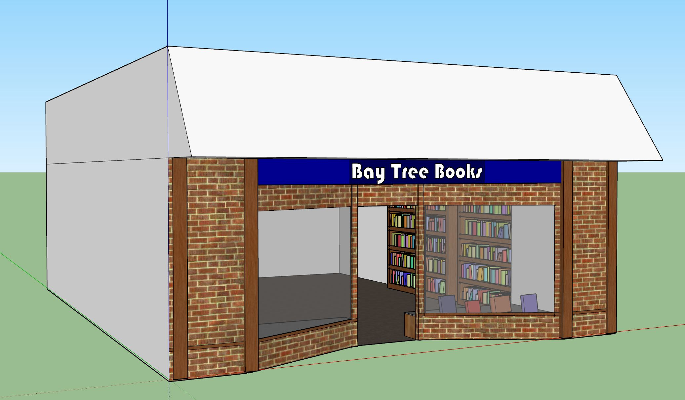

# Bay Tree Books (c.1970)
116 Throckmorton Avenue, Mill Valley, CA 94941

## Building History

In the 1920s this building was a real estate agency.  By 1970 (the era of this model), the building housed "Bay Tree Books" and is now the site of Lando Boutique.

- Built: c.tbd
- Replaced: c.tbd
- Architect: tbd
- Library link: tbd

## SketchUp Model

- Made by Leland LeVassar, Nikki Batroff
- Model completed: December, 2017
- Modeled in SketchUp Make 2017

### Online references & photographs
* tbd

## TimeWalk Images

