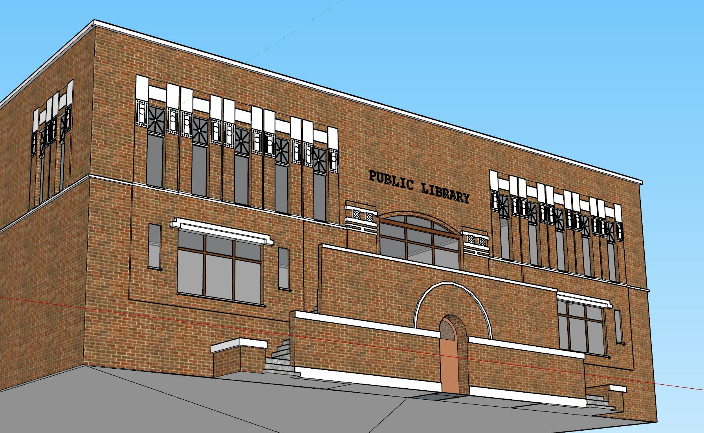
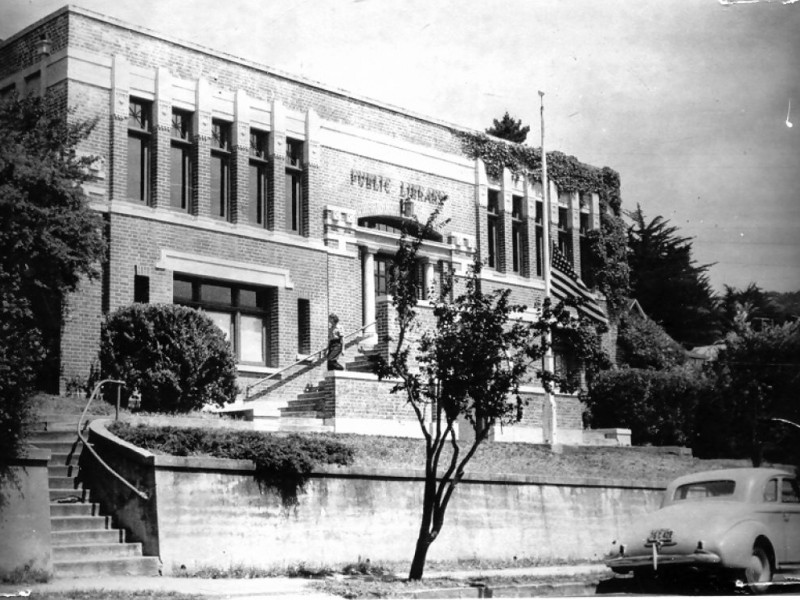

# The Carnegie Library
52 Lovell Avenue, Mill Valley, CA 94941

## Building History

"Mill Valley's first library was based on a private collection of books belonging to the Outdoor Art Club, a woman's group dedicated to "protection of trees and birds." In 1908 the books were given to the city which housed them in temporary locations until a Carnegie grant of $10,000 was received in 1910; more was unsuccessfully sought to meet building costs reported to be $22,500. Architect C.H. Russell designed the building; Robert Tros was the builder. When the new library was completed, the Carnegie building was sold to a private purchaser for $16,000. It has since been resold, and has served as both multiple and single family residence and studio. The Carnegie cornerstone is on display in the History Room of the new library." (Source: [Carnegie Libraries of California](http://www.carnegie-libraries.org/california/millvalley.html))

"The first library opened on July 22, 1911 at 52 Lovell Avenue. The first librarian was Lillian Gardner, and the library was successful from day one. It grew in popularity, so much so that by the late 1930s, there was talk of moving out of its location for a larger facility." (Source: [Then and Now: Mill Valley](https://patch.com/california/millvalley/then-and-now-mill-valley-library))

- Built: c.1920
- Replaced: Building never replaced
- Architect: C.H.Russell
- Builder: Robert Tros

## SketchUp Model
- Made by Ryan Belza, Max Hasen, Paolo Ciolino
- Model completed: December, 2017
- Modeled in SketchUp Make 2017

### Online references & photographs
- [Carnegie Libraries of California](http://www.carnegie-libraries.org/california/millvalley.html)
- [Then and Now: Mill Valley](https://patch.com/california/millvalley/then-and-now-mill-valley-library)

## TimeWalk Images

