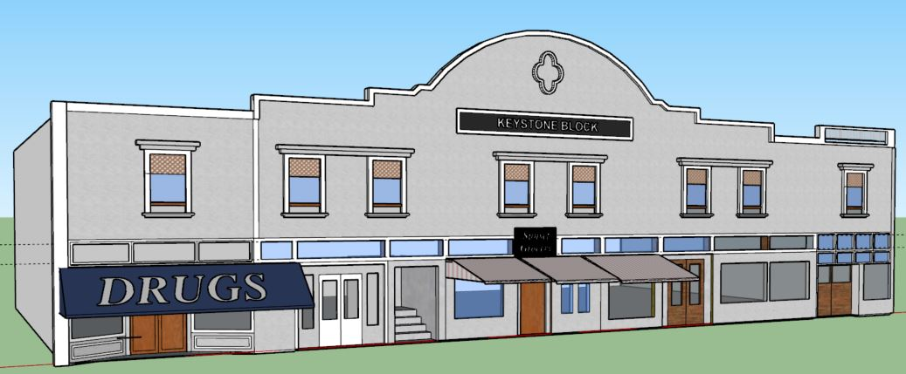
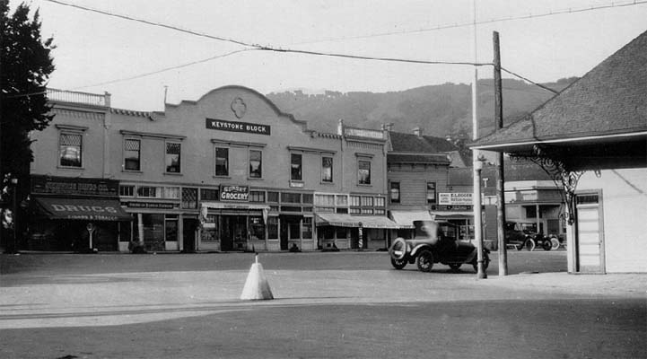

# The Keystone Building
82-100 Throckmorton Avenue, Mill Valley, CA 94941

## Building History

In 1920 the building housed multiple small shops. These included a drug store and a grocery store. It was considered to be in the center, or the heart of town and was a common meeting place for people. It is right across the street from the train depot and was commonly used as a parking lot.

- Built: c.1907
- Replaced: c.1934 (into a tudor style building)
- Architect: Unknown
- Library link: N/A

## SketchUp Model

- Made by Dylan Garay
- Model completed: December, 2017
- Modeled in SketchUp Make 2017

### Online references & photographs
* [1920s photo behind Depot](https://archive.org/details/cmlpl_000226)
* [History notes](https://www.mvhistory.org/wp-content/uploads/2012/10/2011WIH-GBk-v11b.pdf) Mentions John Rea, excerpt: "In 1897, the reverend John Rea, a Congregational minister from Oakland, retired to Mill Valley where he became a successful real estate broker and builder (he built the Keystone block on Lytton Square and the Congregational Church on Summit Ave.)."
