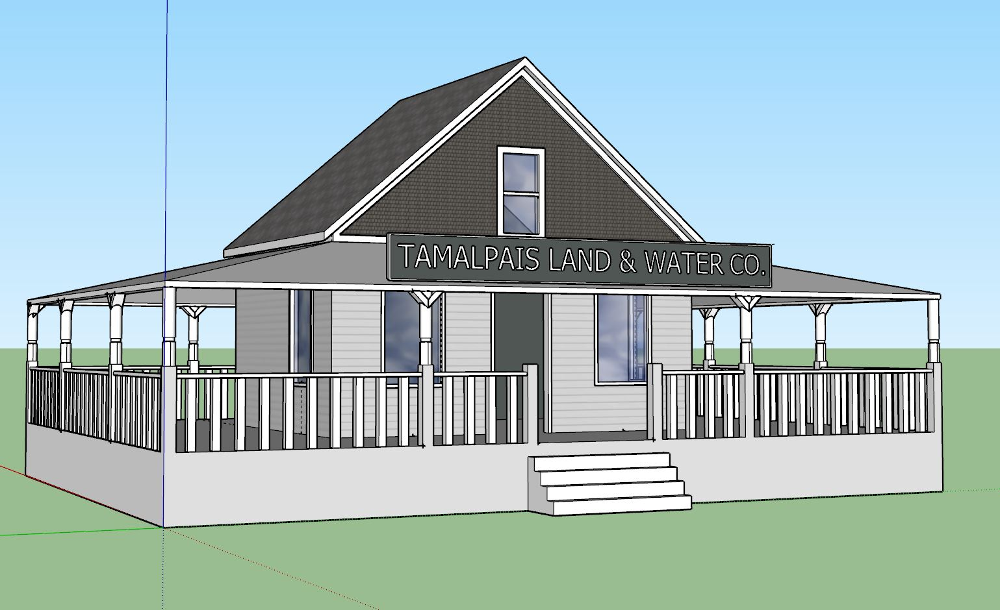
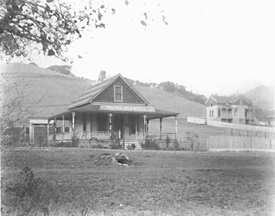
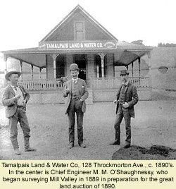

# The Tamalpais Land and Water Company Building
~130 Throckmorton Avenue, Mill Valley, CA 94941

## Building History

This is the building from which Mill Valley properties were auctioned off at the 1890 auction.  We believe it was still standing in 1920, though we have no photos from that period.

- Built: c.tbd
- Replaced: c.tbd
- Architect: tbd
- Library link: tbd

## SketchUp Model

- Made by Milo Scola
- Model completed: December, 2017
- Modeled in SketchUp Make 2017

### Online references & photographs
* [SF Genealogy](http://www.sfgenealogy.com/marin/ourtowns/ot_mv.htm)
* [Historical Society](https://www.mvhistory.org/history-of/history-of-homestead-valley/who-owns-the-streets/)

### To Do
- Confirm appearance of building in 1920
- Find construction date

## TimeWalk Images

History:
Upon receiving 3,790 acres of land from Samuel Throckmorton's daughter to settle his 100,000$ of debt after his death, the San Francisco  Savings Union bank created the Tamalpais Land and Water Company on July 17, 1889 in order to sell the land. There office was constructed at 124 Throckmorton Avenue. Advertisements were presented in the SF newspaper to spread word of the upcoming auction. In May 30, 1890 the event commenced, selling 200 lots witch gave the bank an immediate profit of 300,000$. The terms of the sale were "One third cash; balance in one and two years, with interest at 7 percent per annum. Ten per cent to be paid on day of sale and balance of cash payment at expiration of 15 days , which will be allowed for examination of title. Abstract will be furnished for examination" The building stood until April 29, 1953 when it was torn down and replaced by a one story brick office building.
