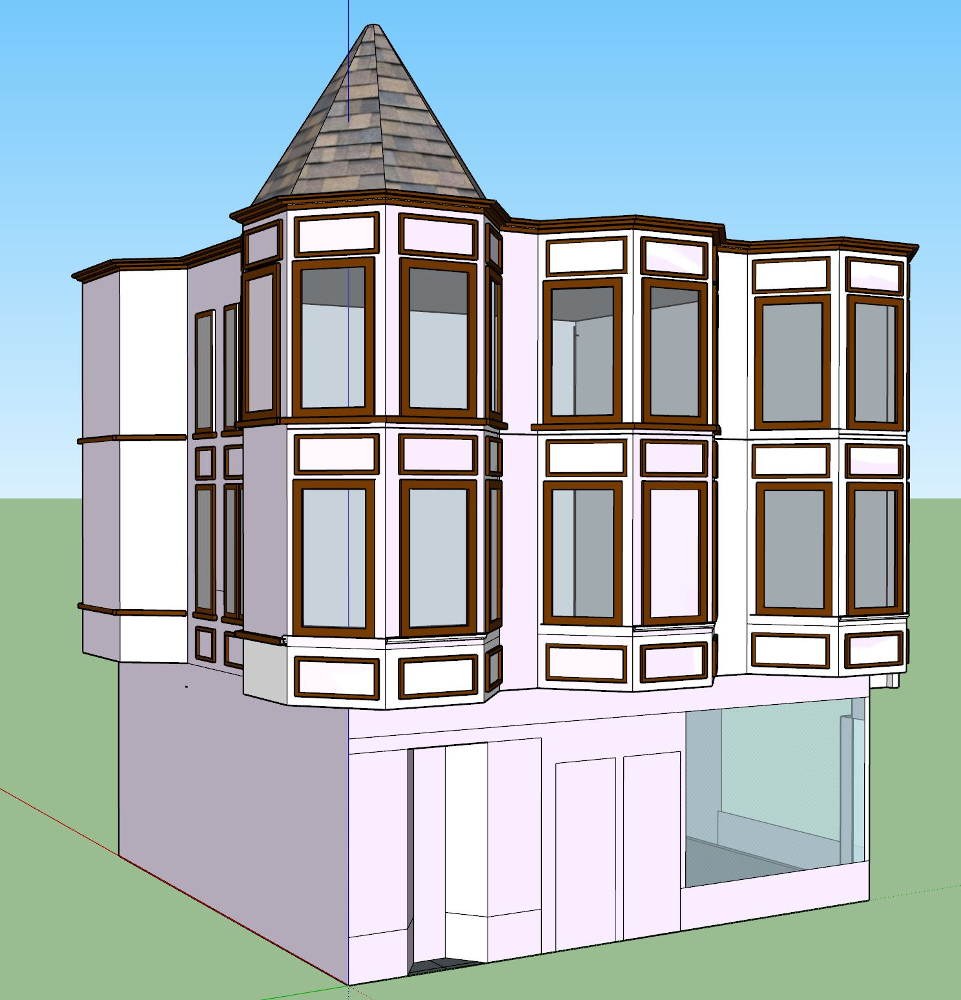

# The Leal Building
2 Miller Avenue, Mill Valley, CA 94941

## Building History

Constructed around the year 1890, this building was the biggest building in Mill Valley. It was three layers tall, housing several small stores on the bottom layer but conserving the top for small businesses and workplaces. Owned by Franke E. Lockwood from 1906 to 1936, it was considered among the largest business block in Mill Valley. It was bought by Mary Simpson Birnie in 1936 for $50,000, or the equivalent of approximately $940,000 today. 

- Built: 1895
- Remodeled: c.1940 ("Moody Blues", Later the Equator Coffee building)
- Architect: tbd
- Library link: http://www.millvalleylibrary.net/historyroom/collections/items/show/142

## SketchUp Model

- Made by Alexander Kraemling, Nicolas Owenson
- Model completed: December, 2017
- Modeled in SketchUp Make 2017

## Design Decisions (1920 Version)
- We decided to base all of our measurements off of the wooden model in the Mill Valley History Room.
- We had nothing to base color off of, so we looked at other buildings around it from the same time to get an idea of what colors it may be.

### Online references & photographs
* [Spring 1984 Mill Valley Historical Review](http://www.millvalleylibrary.net/historyroom/collections/archive/files/mvhs1984spring-reduce_910d348bce.pdf) Mentions the Leal Building, excerpt: "On the Miller Avenue corner opposite the station the largest building in Mill Valley was constructed . It was three stories tall and topped by a cone shaped tower. It was known as the Leal Building (now Moody Blues). There were several shops at the ground level and the upper floors were offices and apartments. "

## TimeWalk Images
