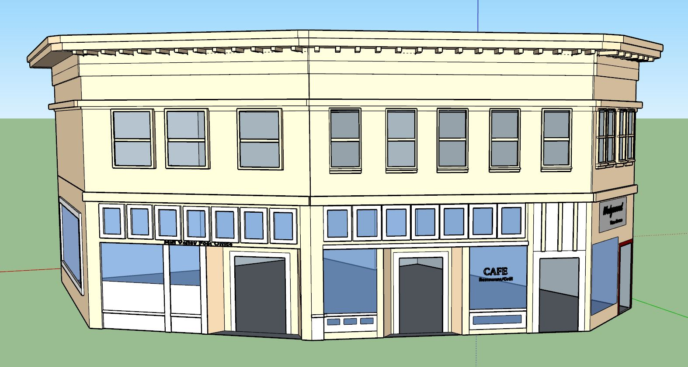

# The O'Shaughnessy Building
41-67 Throckmorton Avenue, Mill Valley, CA 94941

## Building History
"By 1893 The O'Shaughnessy building was built... looking very much as it does today. It operated as a hotel called, at various periods, the "Mill Valley House" and "Alpha Hotel" under different managements. The proprietor, Michael O'Shaughnessy , was the engineer who designed the Hetch Hetchy Dam, the Twin Peaks Tunnel in San Francisco and laid out the streets and lots for the Tamalpais Land and Water Company." (Source: [Mill Valley Historical Society - Spring 1984](http://www.millvalleylibrary.net/historyroom/collections/archive/files/mvhs1984spring-reduce_910d348bce.pdf))

In 1920, this building housed several businesses: tbd

- Built: 1893
- Remodeled: tbd
- Architect: tbd

## SketchUp Model

- Made by Sara Kubo and Hayley Lucero
- Model completed: December, 2017
- Modeled in SketchUp Make 2017

## Design Decisions (1920 Version)
- tbd

### Online references & photographs
- [Mill Valley Historical Society - Spring 1984](http://www.millvalleylibrary.net/historyroom/collections/archive/files/mvhs1984spring-reduce_910d348bce.pdf) Building mentioned on page 4
- [Michael O'Shaugnessy - Wikipedia](https://en.wikipedia.org/wiki/Michael_O%27Shaughnessy)
- [Mention of building](https://www.enjoymillvalley.com/-blog/renovation-of-tyler-florence-shop-building-reveals-billboard-sized-sign-of-former-purity-grocery-store)

## TimeWalk Images

