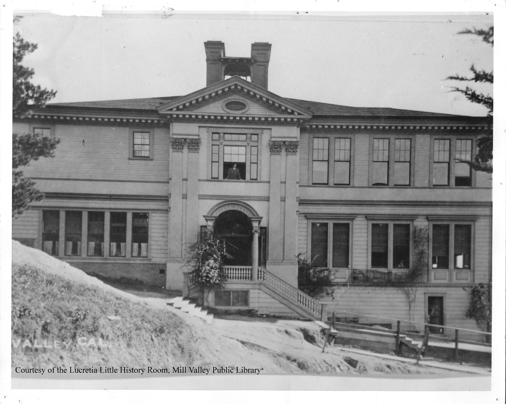
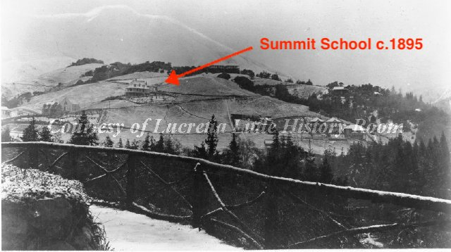

# The Summit School
~9 Summit Avenue, Mill Valley, CA 94941

## Building History

In the 1920s this building was one of the primary elementary schools in Mill Valley. The Summit School was the first and one of the most populated elementary schools in Mill Valley. It served as the only elementary school for all of Mill Valley from 1892 - 1908. The original building on the plot was a one-room building with an enrollment of 35. This served as the school from 1892 to 1896 when it was expanded to a two story building to accommodate more students. The building was used until June of 1939, when it was replaced by the large Old Mill School. The building was finally demolished in 1941 and the plot, that now holds six homes, was sold for $1,350.

- Built: tbd
- First used as a school: c.1892
- Remodeled: c.1896
- Demolished: 1941
- Architect: tbd
- Library link: tbd

## SketchUp Model

- Made by Scott Roche
- Model completed: December, 2017
- Modeled in SketchUp Make 2017

## Design Decisions
- I based my dimensions of the building off of an estimate based on the current size of Old Mill and a floor plan containing some basic dimensions
- I based the height off of an estimate based off of the straight on view with a man looking out the window. I estimated his height, then used this to find the building height.

### Online references & photographs
 references her time at the Summit School

 Photo c.1910, Courtesy of the Lucretia Little History Room, Mill Valley Public Library 

Photo c.1908, Courtesy of the Lucretia Little History Room, Mill Valley Public Library 

 Photo of Mill Valley c.1895, Courtesy of the Lucretia Little History Room, Mill Valley Public Library 

## TimeWalk Images

