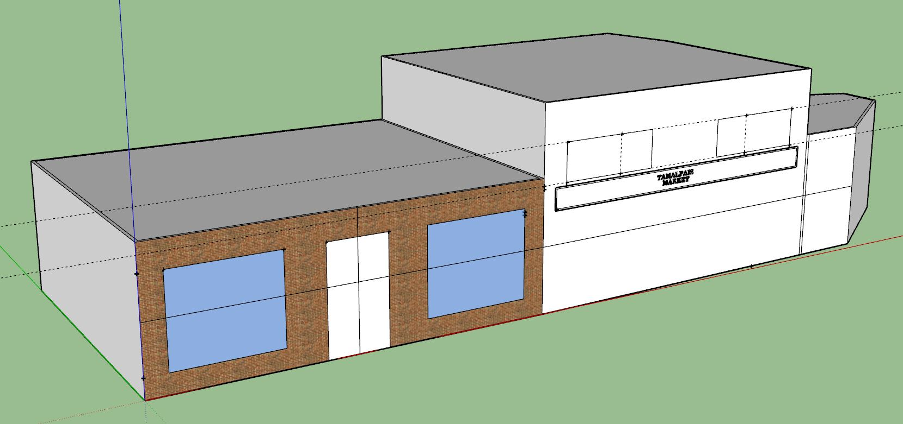

# Tamalpais Market (the "Mill Valley Market" as of 2017)
12 Corte Madera Avenue, Mill Valley, CA 94941

## Building History

Mill Valley Market was founded on July 4th 1929 by Frank Canepa. The store started out as a produce market located at 118 Throckmorton Avenue. When the market first opened they were one of close to a dozen small groceries around town, but it is the only one still in operation today. Frank's oldest son Jim Canepa took over the store in 1955, and moved it to its current location. Jim deserves the credit for turning Mill Valley Market into the place it is today. He loved food and the town of Mill Valley. He branched out and brought in many of the amazing items you can find at the store today. Jim also set a great example for his children and grandchildren by putting his heart and passion into the business. In 1975, Jim's younger brother Bob Canepa became a partner in the business as well. The current owners are  David and Doug Canepa, they purchased the business from their father Jim in 1990. Like Jim, they both started working at Mill Valley Market as children. They have continued in their father's footsteps by expanding the store. The goal remains the same as it has been since 1929, to offer great products and excellent service without exception.

- Built: c.tbd
- Replaced: c.tbd
- Architect: tbd

## SketchUp Model
- Made by Benjamin Grant and Ethan Kim
- Model completed: January, 2018
- Modeled in SketchUp Make 2017

### Online references & photographs
[Early 1920s](Tamalpais%20Market%20-%20Early%201900s%20-%20MVN5001.jpg)
Tamalpais Market 
* [Early 1900s](Tamalpais%20Market%20-%20Early%201900s%20-%20MVN5001.jpg)

## TimeWalk Images

