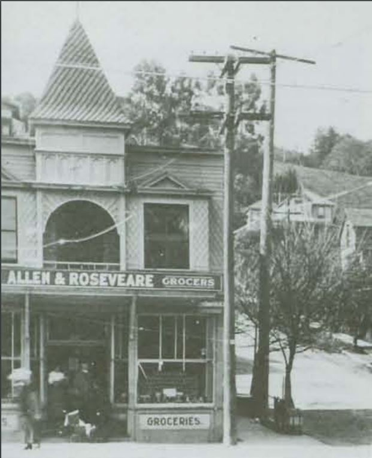

# Vasco
106 Throckmorton Ave., Mill Valley, CA 94941

## Building History

"The first lot sold at the auction of 1890 was located at the corner of Bernard and Throckmorton Avenues. It was leased as the site of a carpenter shop which was replaced by 1894 with a two story building crowned with a cupola that became Wheeler Martin's Pioneer Grocery.  Martin was appointed postmaster in 1894 and the post office was moved to his store from the railroad station." Source: [Mill Valley Historical Society Review, Spring 1984](http://www.millvalleylibrary.net/historyroom/collections/archive/files/mvhs1984spring-reduce_910d348bce.pdf) 

In the 1920's this building was known as Roseveare & Allen Grocers.

- Built: Lot sold in 1890, Pioneer Grocery opened in 1894
- Replaced: Remodeled, but never replaced
- Architect: Unknown

## Occupants:
- Carpenter shop (1890-1894)
- The Pioneer Grocery (1894-?)
- Roseveare & Allen Grocers (?-?)
- The Old Mill Tavern (?-?)
- Vasco (?-present)

## SketchUp Model

- Made by Henry Basnight, Nathan Schwartzman, Rowan Olds
- Model completed: December, 2017
- Modeled in SketchUp Make 2017

### Online references & photographs

- [Mill Valley Historical Society Review, Spring 1984](http://www.millvalleylibrary.net/historyroom/collections/archive/files/mvhs1984spring-reduce_910d348bce.pdf) - Photo on page 5
- [Wheeler Martin's grocery store, c.1890](http://content.cdlib.org/ark:/13030/kt5f59q8tq/?layout=metadata) - Includes 1890 photo
- [Google Books link to Mill Valley history book](https://books.google.com/books?id=_DHbKTGAslsC&pg=PA63&lpg=PA63&dq=wheeler+martin+mill+valley&source=bl&ots=jtfx6bGqfH&sig=4T5j9L2S8IzL5uC2Ud22tFLfN3I&hl=en&sa=X&ved=0ahUKEwjpr5Gt1_HXAhVMImMKHR_0AkYQ6AEIPzAE#v=onepage&q=wheeler%20martin%20mill%20valley&f=false)
- [Mill Valley Market Facebook page](https://www.facebook.com/permalink.php?story_fbid=10154518749938416&id=8461123415)

## TimeWalk Images

## Future Edits
- Model is based on c1894 photo: look for 1920 versions to ensure accuracy
- Sign read "Roseveare & Allen" in 1920?
